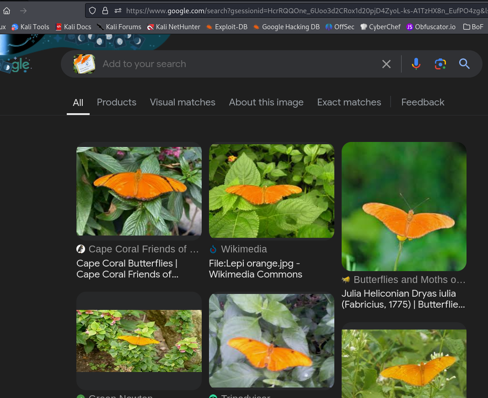

# Bullet with Butterfly Wings

## OSINT

### I took this picture, but I can't remember the name of the place!  Despite all my rage, I am still just a rat in a cage.

#### NOTE: you'll see some extra files in the directory.  I originally was going to put some Dutch in the clue but then Google Images changed its search and made it easier to narrow the images.  If no one solved this I would have added the hint, but it didn't need it.

If you look at the text in the image, take a guess it Dutch, which is what they speak in the Netherlands.

When you put the image in images.google.com it returns a bunch of false leads

If you add Netherlands to the search you get hits

Opening up one of the first ones you can see it's Hortus Botanicus in Amsterdam.

**teractf{Hortus_Botanicus}**

