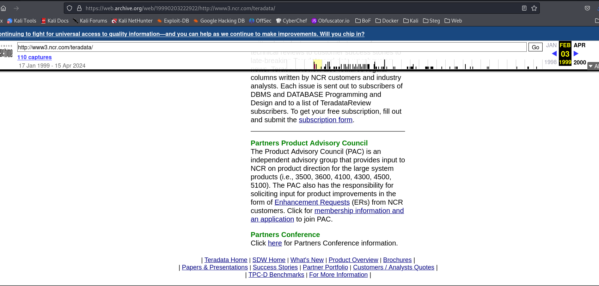
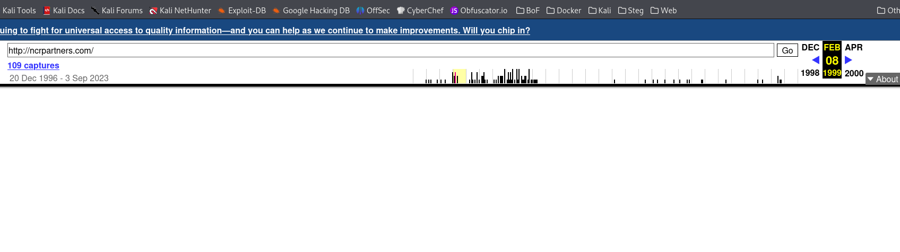
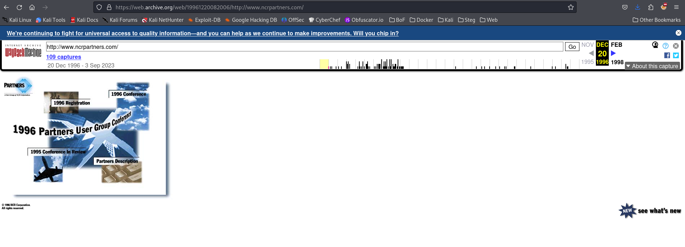
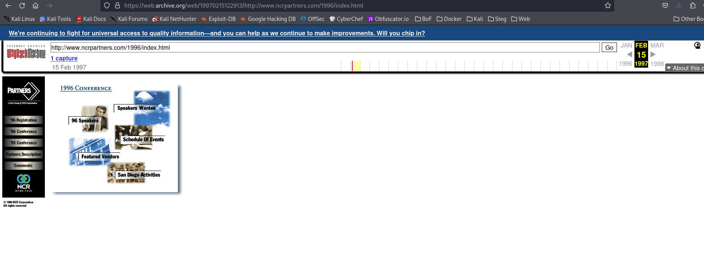
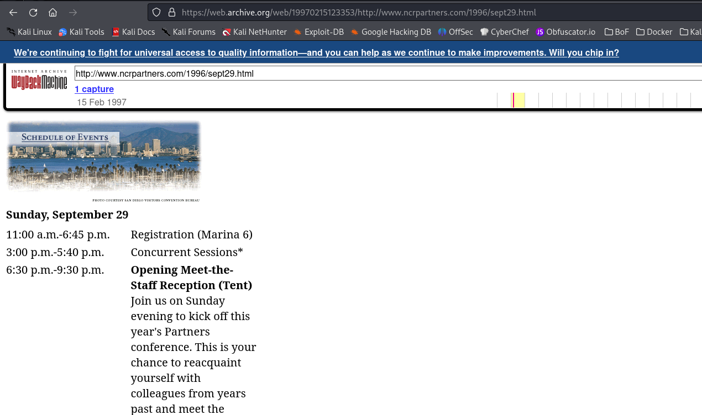

# Don't Look Back

## OSINT

### I was talking with my friends Sherman and Peabody.  They told me about attending something called Partners in 1996.  They said they saw a flag in the hall where registration took place.  To complete this challenge you need to supply the opening date for Partners and the hall and hall number listed for registration e.g., teractf{January_1_Island_1}.  

Don't look back, a new day is breakin'.  It's been too long since I looked at this.

Solution:

The clue contains the names Sherman and Peabody, who used the Wayback Machine.  

Use the web.archive.org and go back to the 1998.  There is only one listing - December 12, 1998.  Clicking on it redirects to an NCR site for February 1999.  

At the bottom of that page is a Partners Conference entry with a link.  If you click on that it lands on a blank page in 1999.  

When you click on 1996, it brings up a page with the 1996 Confernce landing page.

Click the upper right 1996 Conference and you get an index page.

Click on Schedule of Events and there is a list of the Conference dates.  Click on the September 29, 1996 link.

**teractf{September_29_Marina_6}**

