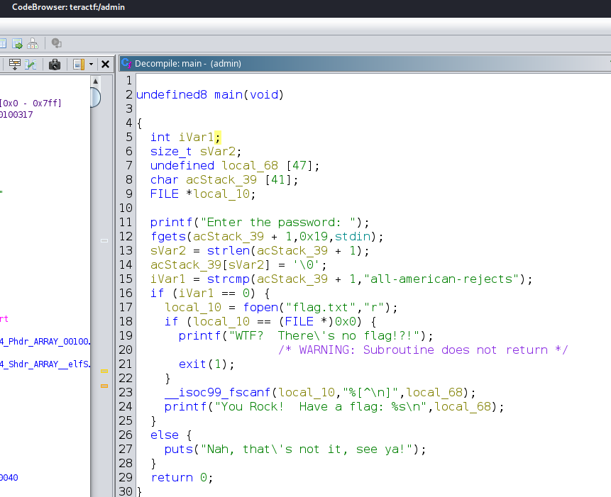

# Dirty Little Secret

## Pwn

### Let me know what I've done wrong, when I've known it all along...  My dirty little secret, who has to know?

All that's required is to figure out the password and submit it.

Two paths to get there:

Strings Solution:

1. Run strings command:

```sh
$ strings -n 10 admin                      
/lib64/ld-linux-x86-64.so.2
__libc_start_main
__isoc99_fscanf
__cxa_finalize
GLIBC_2.2.5
GLIBC_2.34
_ITM_deregisterTMCloneTable
__gmon_start__
_ITM_registerTMCloneTable
Enter the password: 
all-american-rejects
You Rock!  Have a flag: %s
WTF?  There's no flag!?!
Nah, that's not it, see ya!
GCC: (Debian 13.3.0-6) 13.3.0
```
2. Notice the string after `Enter the password`
3. Submit it

Decompile Solution:

1. Open the binary in your favorite decompiler.
2. Read the code.



3. Submit the password

**teractf{th1s_1s_my_d1rty_L1ttL3_s3r3t}**
