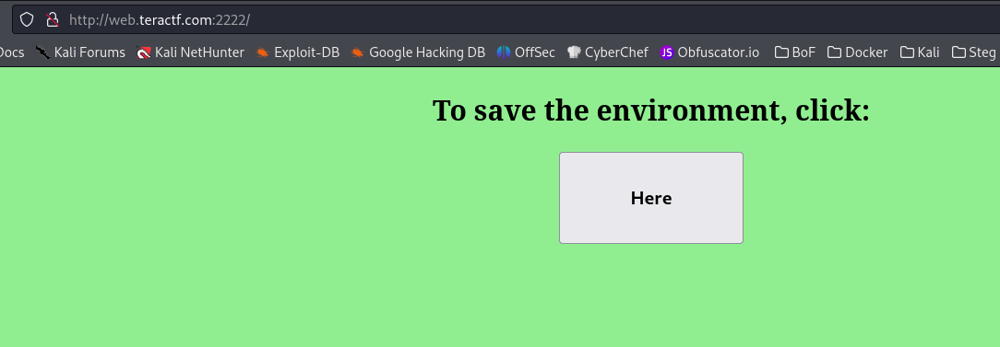
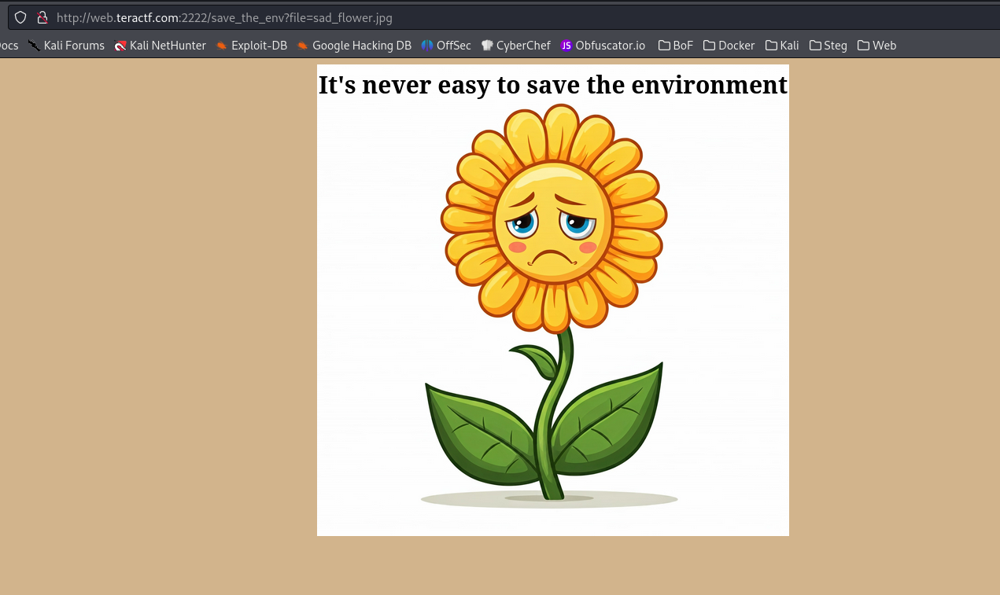
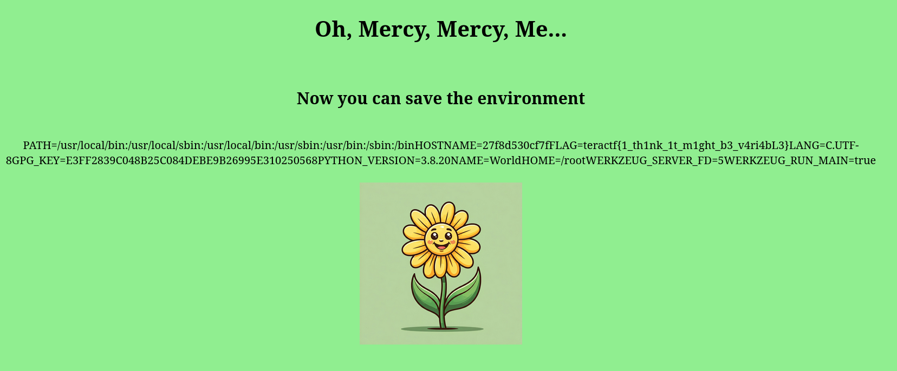

# Mercy Mercy Me

## Web

### Ah, things ain't what they used to be.  Where did all the blue skies go?  I guess Marvin was right, it's all about the environment.

The landing page doesn't have much, just a button to save the environment.

When you click on the button it, you see the sad flower and another reference to the environment

If you try a path traversal with anything but /proc/self/environ it won't work....but when you do use that string, you see the environment (variables).

**teractf{1_th1nk_1t_m1ght_b3_v4ri4bL3}**

